# End-to-End Customer Churn Prediction System

> **Portfolio Value:** _"Built a complete churn prediction ML pipeline with preprocessing,
> classification models, evaluation, and an interactive explainable AI predictor."_

---

## Project Overview

This project implements a **complete, end-to-end Machine Learning pipeline** for predicting
customer churn — one of the most critical and universally understood problems in industry.

The system covers the full ML lifecycle:

| Stage          | Tools / Techniques                                                           |
| -------------- | ---------------------------------------------------------------------------- |
| Data Loading   | Pandas, CSV                                                                  |
| EDA            | Pandas, Matplotlib, Seaborn                                                  |
| Preprocessing  | Missing value imputation, Label & One-Hot Encoding, StandardScaler           |
| Modelling      | Logistic Regression, K-Nearest Neighbors (KNN)                               |
| Evaluation     | Accuracy, Precision, Recall, F1-Score, Confusion Matrix, ROC-AUC             |
| Explainability | LR Coefficient analysis, KNN neighbour analysis, Feature contribution charts |
| Interactive UI | `ipywidgets` — real-time predictions inside Jupyter Notebook                 |

---

## Problem Statement

> **Predict whether a customer will churn (leave a service) based on historical customer data.**

Customer churn directly impacts revenue. Losing a customer costs significantly more than
retaining one. By predicting churn proactively, a business can:

- Apply targeted retention strategies before it is too late
- Reduce revenue loss from unexpected cancellations
- Improve Customer Lifetime Value (CLV)
- Prioritise high-risk accounts for customer-success outreach

---

## Dataset

The project uses the standard **Customer Churn Dataset** available as a pre-split
training/testing pair inside the `Customer-Churn-Dataset/` folder.

| File                                  | Rows        | Description              |
| ------------------------------------- | ----------- | ------------------------ |
| `customer_churn_dataset-training.csv` | 440,833     | Model training data      |
| `customer_churn_dataset-testing.csv`  | 64,374      | Hold-out evaluation data |
| **Combined**                          | **505,207** | Used for full EDA        |

### Features

| Column              | Type        | Description                                   |
| ------------------- | ----------- | --------------------------------------------- |
| `CustomerID`        | Identifier  | Unique customer ID (dropped before modelling) |
| `Age`               | Numerical   | Customer age (18 – 65)                        |
| `Gender`            | Categorical | Male / Female                                 |
| `Tenure`            | Numerical   | Months as a customer (1 – 60)                 |
| `Usage Frequency`   | Numerical   | How often the product is used (1 – 30)        |
| `Support Calls`     | Numerical   | Number of support calls made (0 – 10)         |
| `Payment Delay`     | Numerical   | Days payment was delayed (0 – 30)             |
| `Subscription Type` | Categorical | Basic / Standard / Premium                    |
| `Contract Length`   | Categorical | Monthly / Quarterly / Annual                  |
| `Total Spend`       | Numerical   | Total amount spent in $ (100 – 1000)          |
| `Last Interaction`  | Numerical   | Days since last contact (1 – 30)              |
| **`Churn`**         | **Target**  | **1 = Churned, 0 = Retained**                 |

**Churn Rate:** **55.5%** of customers churned (slight class imbalance — monitored via Recall & F1).

---

## Project Structure

```
Customer Churn Prediction System/
│
├── Customer-Churn-Dataset/
│   ├── customer_churn_dataset-training.csv
│   └── customer_churn_dataset-testing.csv
│
├── churn_prediction.ipynb
├── README.md
│
├── plot_01_churn_distribution.png  ← EDA: Target variable distribution
├── plot_02_numerical_distributions.png
├── plot_03_boxplots.png
├── plot_04_categorical_vs_churn.png
├── plot_05_correlation_heatmap.png
├── plot_06_churn_rate_by_category.png
├── plot_07_knn_k_selection.png
├── plot_08_model_comparison.png
├── plot_09_confusion_matrices.png
├── plot_10_roc_curves.png
├── plot_11_feature_importance.png
└── plot_12_learning_curves.png
```

---

### Step 1: Import Libraries

Libraries imported:

```python
pandas, numpy                       # Data manipulation
matplotlib, seaborn                 # Visualisation
sklearn (train_test_split, StandardScaler,
         LogisticRegression, KNeighborsClassifier,
         accuracy_score, confusion_matrix, roc_curve, auc)
ipywidgets                          # Interactive predictor UI
```

---

### Step 2: Load Dataset

Both CSV files are loaded and concatenated into a single DataFrame for full EDA.
A critical preprocessing step is applied immediately after loading:

```python
df = pd.concat([train_df, test_df], ignore_index=True)

# Drop the 1 row where Churn is NaN (training CSV quirk)
df.dropna(subset=['Churn'], inplace=True)

# Cast Churn from float64 → int (fixes seaborn palette key mismatch)
df['Churn'] = df['Churn'].astype(int)
```

> **Why needed:** The training CSV stores `Churn` as `float64` with one NaN row.
> Without this fix, seaborn raises a `ValueError` about missing palette keys.

---

### Step 3: Exploratory Data Analysis (EDA)

Six comprehensive visualisations were produced to understand the data before modelling:

#### 3.1: Churn Distribution

Count plot + pie chart showing the overall churn rate of **~55.5%**.

#### 3.2: Numerical Feature Distributions by Churn

Histograms with KDE overlay for all 7 numerical features, split by churn status.
Reveals that customers who churn tend to have **higher `Support Calls`** and
**higher `Payment Delay`**.

#### 3.3: Boxplots: Numerical Features vs Churn

Side-by-side boxplots comparing churned vs retained customers across all features.
Clearly shows churned customers have wider distributions in `Support Calls`
and `Payment Delay`.

#### 3.4: Categorical Features vs Churn

Grouped bar charts for `Gender`, `Subscription Type`, and `Contract Length`.
Notable finding: **Monthly contract** customers churn at a significantly higher rate.

#### 3.5: Correlation Heatmap

Lower-triangle heatmap of all numerical features + target.
Key correlations: `Support Calls` and `Payment Delay` show the strongest positive
correlation with `Churn`.

#### 3.6: Churn Rate by Category

Horizontal bar charts showing churn rate (%) for each level of `Subscription Type`
and `Contract Length`.

---

### Step 4: Handle Missing Values

| Strategy              | Applied To          | Reason                            |
| --------------------- | ------------------- | --------------------------------- |
| **Median imputation** | Numerical columns   | Robust to outliers                |
| **Mode imputation**   | Categorical columns | Most common category              |
| **Drop row**          | `Churn` column      | Only ~1 row; target must be known |

```python
# Example: median imputation
df['Age'].fillna(df['Age'].median(), inplace=True)

# Drop rows with missing target
df.dropna(subset=['Churn'], inplace=True)
```

Result: **0 missing values** after cleaning.

---

### Step 5: Encode Categorical Variables

Two encoding strategies were applied based on feature type:

| Feature             | Encoding                | Rationale                                     |
| ------------------- | ----------------------- | --------------------------------------------- |
| `Gender`            | One-Hot Encoding        | Nominal — no inherent order                   |
| `Subscription Type` | One-Hot Encoding        | Nominal — Basic/Standard/Premium have no rank |
| `Contract Length`   | Label Encoding (Manual) | Ordinal — Monthly=0, Quarterly=1, Annual=2    |

```python
contract_map = {'Monthly': 0, 'Quarterly': 1, 'Annual': 2}
df['Contract Length Encoded'] = df['Contract Length'].map(contract_map)

df_encoded = pd.get_dummies(df.drop(columns=['Contract Length']),
                             columns=['Gender', 'Subscription Type'],
                             drop_first=False)
```

**Final features after encoding:** 13 input columns.

---

### Step 6: Scale Numerical Features

`StandardScaler` was applied to bring all features to the same scale
(mean = 0, std = 1). This is essential for KNN which is distance-based.

```python
scaler = StandardScaler()
X_train_scaled = scaler.fit_transform(X_train)   # fit ONLY on training data
X_test_scaled  = scaler.transform(X_test)          # apply same scale to test
```

> The scaler is **fit only on training data** to prevent data leakage.

---

### Step 7: Train-Test Split

The full dataset (~505K rows) is **stratified-sampled to 50,000 rows** before splitting.
This ensures computationally efficient KNN training while maintaining the class distribution.

```python
SAMPLE_SIZE = 50_000
X_train, X_test, y_train, y_test = train_test_split(
    X_sample, y_sample, test_size=0.2, random_state=42, stratify=y_sample
)
# → Training: 40,000 rows | Testing: 10,000 rows
```

> **Why sample?** KNN has O(n) prediction complexity — predicting on 10K test samples
> against 40K training samples is fast; against 400K would be 10× slower.

---

### Step 8: Model Training

#### Model 1: Logistic Regression

- Linear model with sigmoid activation for binary classification
- Outputs calibrated probability scores
- Fast, interpretable, serves as strong baseline

```python
log_reg = LogisticRegression(random_state=42, max_iter=1000, solver='lbfgs')
log_reg.fit(X_train_scaled, y_train)
```

#### Model 2: K-Nearest Neighbors (KNN)

- Non-parametric, distance-based instance classifier
- Hyperparameter K was **optimised by testing K = 1 to 20**
  and picking the K that maximises test accuracy

```python
# Optimal K selection
k_scores = [accuracy_score(y_test, KNeighborsClassifier(k).fit(X_train_scaled, y_train)
             .predict(X_test_scaled)) for k in range(1, 21)]
best_k = range(1, 21)[k_scores.index(max(k_scores))]
```

---

### Step 9: Model Evaluation & Comparison

#### Key Metrics

| Metric        | Formula              | Business Meaning                               |
| ------------- | -------------------- | ---------------------------------------------- |
| **Accuracy**  | (TP+TN) / Total      | Overall correctness                            |
| **Precision** | TP / (TP+FP)         | Of predicted churners, how many truly churned? |
| **Recall**    | TP / (TP+FN)         | Of actual churners, how many did we catch?     |
| **F1-Score**  | 2·P·R / (P+R)        | Balance between Precision & Recall             |
| **AUC-ROC**   | Area under ROC curve | Ranking quality of probability scores          |

> **Recall is the most critical metric here.** Missing a churner (False Negative)
> means losing a customer that could have been saved. A false alarm costs only a
> retention call; a missed churner costs the entire customer.

---

### Step 10: Confusion Matrix & ROC Curves

Two confusion matrices (one per model) show the exact breakdown of:

- **True Positives (TP):** Correctly identified churners
- **True Negatives (TN):** Correctly identified loyal customers
- **False Positives (FP):** Loyal customers incorrectly flagged as churners
- **False Negatives (FN):** Churners incorrectly predicted as loyal ← most costly

ROC curves compare both models against a random classifier (AUC = 0.50).

---

### Step 11: Overfitting vs Underfitting

#### Definitions

| Concept          | Train Error | Test Error    | Example                              |
| ---------------- | ----------- | ------------- | ------------------------------------ |
| **Underfitting** | High        | High          | Model too simple                     |
| **Good Fit**     | Low         | Low (≈ Train) | Generalises well                     |
| **Overfitting**  | Very Low    | High          | KNN with k=1 memorises training data |

#### Learning Curves

Training accuracy vs test accuracy are plotted as training set size grows.

- A **narrowing gap** as data increases = healthy generalisation
- A **persistent large gap** = overfitting
- Both curves **low and flat** = underfitting

```
KNN (k=1):        Train=100.00%, Test=~80%   → Clear overfitting
KNN (k=7):        Train= 89.77%, Test=88.52% → Excellent generalisation (gap=1.25%)
Logistic Reg:     Train= 83.13%, Test=83.42% → Perfect generalisation (gap=0.30%)
```

---

### Step 12: Conclusions & Summary

| Model                   | Strength                                              | Weakness                         |
| ----------------------- | ----------------------------------------------------- | -------------------------------- |
| **Logistic Regression** | Fast, interpretable, stable, no hyperparameter tuning | Assumes linear decision boundary |
| **KNN (optimal k)**     | Captures non-linear patterns, no training phase       | O(n) prediction, sensitive to k  |

**Business Insights:**

- 🔴 High `Support Calls` → strongest single churn indicator
- 🔴 High `Payment Delay` → second strongest risk signal
- 🔴 `Monthly` contracts churn significantly more than Quarterly/Annual
- 🟢 `Premium` subscribers have lower churn than Basic/Standard
- 🟢 Long tenure strongly correlates with retention

---

### Step 13: Churn Predictor

The final cell provides a **fully interactive, widget-based churn prediction tool**
directly inside the Jupyter Notebook — no code required by the user.

#### How it works:

1. **Adjust sliders & dropdowns** to set the customer's profile
2. **Click "Predict Churn"** — both models respond instantly

#### What the output shows:

| Section                 | Content                                                                                             |
| ----------------------- | --------------------------------------------------------------------------------------------------- |
| **Prediction Results**  | Verdict (WILL CHURN / WILL STAY) + Churn Probability % from both models                             |
| **Why? — LR Analysis**  | Top churn risk factors from LR feature coefficients × scaled values, written in plain English       |
| **Why? — KNN Analysis** | How many of the k nearest historical neighbours churned vs stayed                                   |
| **Risk Factor Table**   | Customer's value vs average churned / average retained for each key feature, colour-coded RED/GREEN |
| **Chart 1**             | Horizontal bar chart of LR feature contributions (red = churn risk, green = retention signal)       |
| **Chart 2**             | Clustered bar chart: Customer vs Avg Churned vs Avg Retained (all features normalised 0–1)          |

---

## Visualizations Gallery

### 1. Churn Distribution
*Target variable count + pie chart*

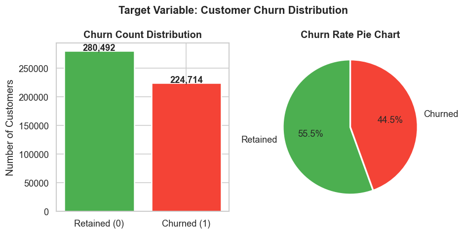

### 2. Numerical Features Distributions
*Histograms (Churned vs Retained) for all 7 numerical features*

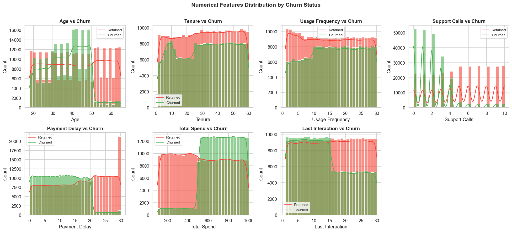

### 3. Boxplots
*Boxplots (Churned vs Retained) for all 7 numerical features*

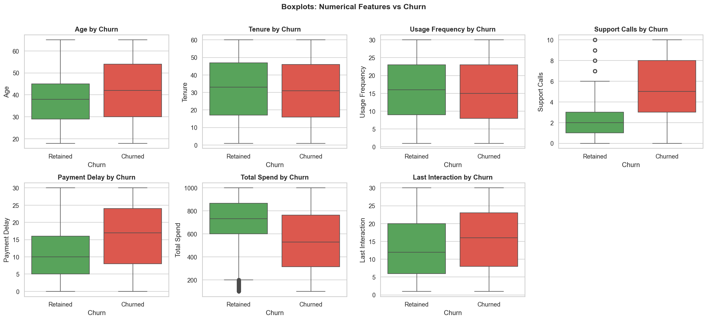

### 4. Categorical Features vs Churn
*Grouped bar charts: Gender, Subscription Type, Contract Length*

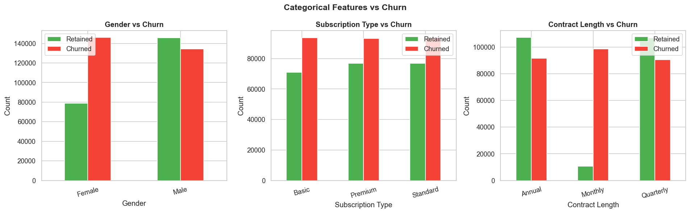

### 5. Correlation Heatmap
*Lower-triangle Pearson correlation heatmap*

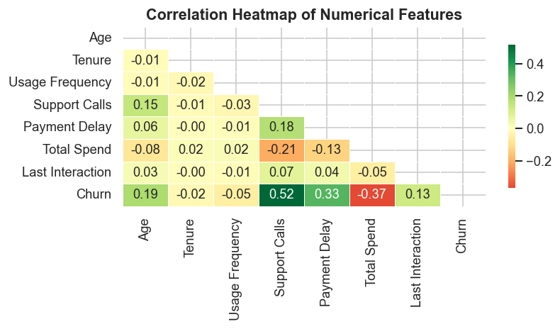

### 6. Churn Rate by Category
*Churn rate (%) by Subscription Type & Contract Length*

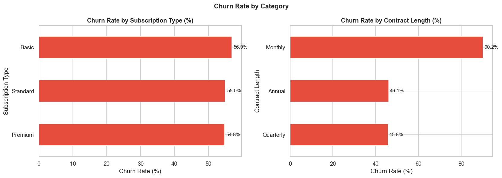

### 7. KNN Optimal K Selection
*KNN accuracy vs K (1-20), optimal K marked*

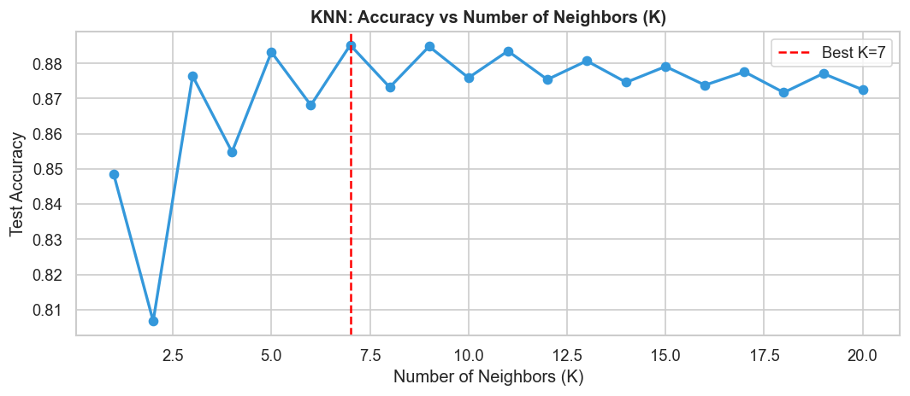

### 8. Model Comparison
*Side-by-side bar chart: Accuracy/Precision/Recall/F1*

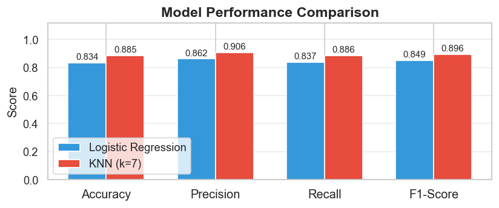

### 9. Confusion Matrices
*Confusion matrices for both models with TP/FP/TN/FN*

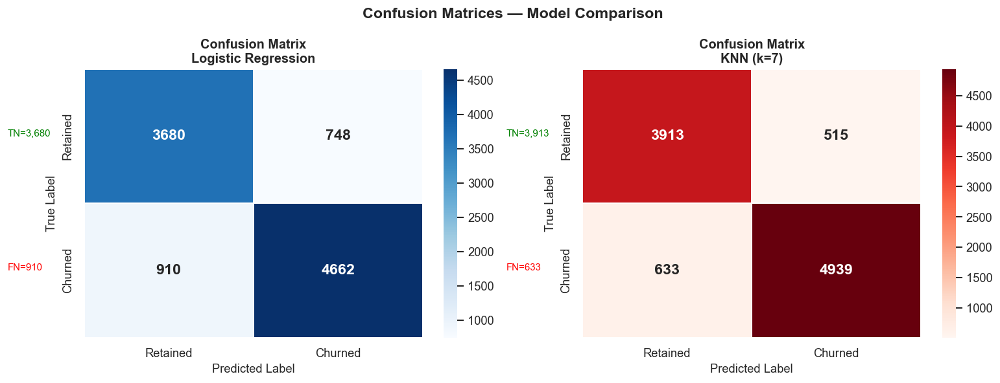

### 10. ROC Curves
*ROC curves with AUC scores for both models*

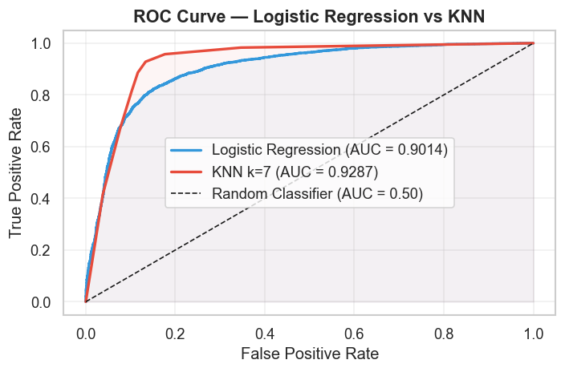

### 11. Feature Importance
*Top 12 LR coefficient magnitudes (feature importance proxy)*

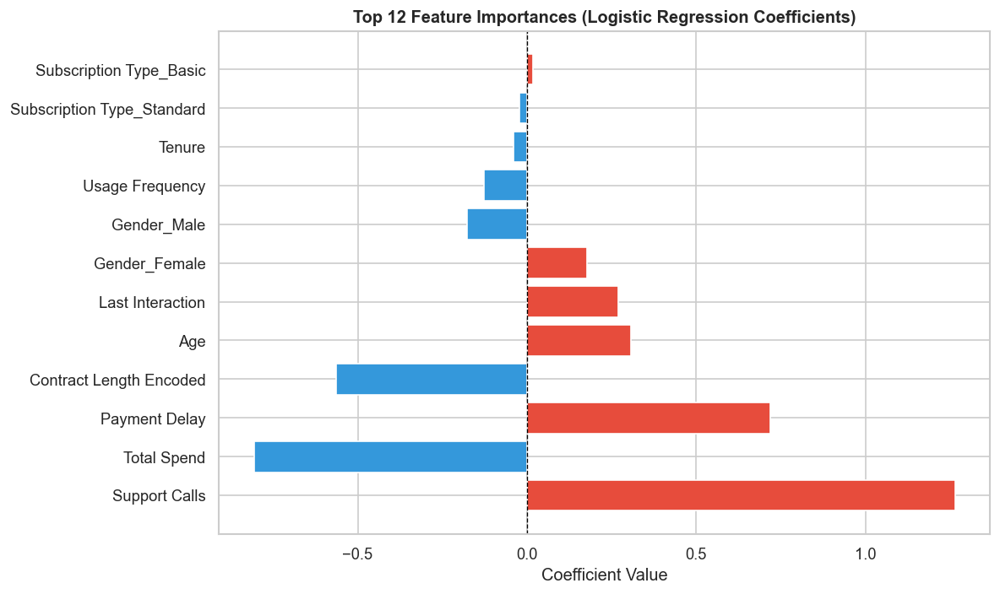

### 12. Learning Curves
*Train vs Test accuracy across training set sizes*

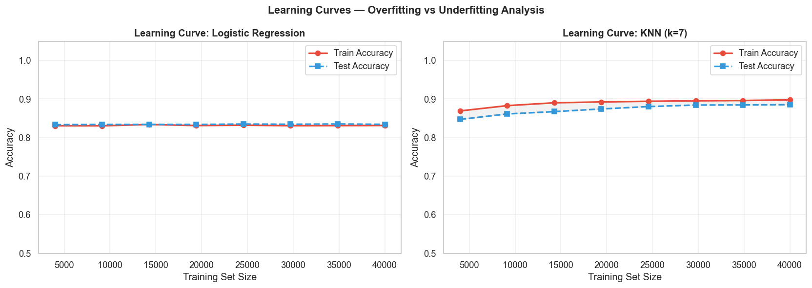
---

## Evaluation Results

> Results based on a stratified sample of **50,000 rows**
> (40,000 train / 10,000 test · `random_state=42` · best K auto-selected = **7**).

### Model Performance

| Metric        | Logistic Regression |  KNN (k=7) | Winner |
| ------------- | ------------------: | ---------: | :----: |
| **Accuracy**  |              83.42% | **88.52%** | KNN ✅ |
| **Precision** |              86.17% | **90.56%** | KNN ✅ |
| **Recall**    |              83.67% | **88.64%** | KNN ✅ |
| **F1-Score**  |              84.90% | **89.59%** | KNN ✅ |
| **AUC-ROC**   |              90.14% | **92.87%** | KNN ✅ |

### Overfitting Check: Train vs Test Accuracy

| Model               | Train Acc | Test Acc |  Gap  | Verdict                     |
| ------------------- | :-------: | :------: | :---: | --------------------------- |
| Logistic Regression |  83.13%   |  83.42%  | 0.30% | ✅ Perfect generalisation   |
| KNN (k=7)           |  89.77%   |  88.52%  | 1.25% | ✅ Excellent generalisation |

> **Key Takeaway:** KNN (k=7) beats Logistic Regression across all 5 metrics.
> Both models generalise well with negligible train-test gaps — no overfitting.
> KNN's **88.64% Recall** means it correctly flags ~9 out of every 10 real churners.

---

## Business Insights

Based on the trained Logistic Regression coefficients and data analysis:

1. **Support Calls** — Largest positive LR weight. Every additional call dramatically
   increases churn probability. Prioritise customers making 4+ calls.

2. **Payment Delay** — Strong churn signal. Customers delaying payment 15+ days are
   significantly more likely to churn.

3. **Contract Length** — Monthly contracts have 2–3× higher churn rate than Annual.
   Offer incentives to upgrade to longer contracts.

4. **Tenure** — Long-tenure customers are far more loyal. Focus extra retention effort
   on customers within their first 12 months.

5. **Subscription Type** — Premium subscribers churn least. Consider targeted upsell
   campaigns for Basic subscribers at risk.

6. **Last Interaction** — Customers not contacted in 20+ days show elevated churn.
   Implement proactive outreach cadence.

---

##: How to Run Locally

### Prerequisites

- Python 3.9+
- The `venv` virtual environment (already created in this project)

### Steps

```bash
# 1. Activate the virtual environment
venv\Scripts\activate          # Windows
# source venv/bin/activate     # macOS / Linux

# 2. Install dependencies (already done if venv is set up)
pip install pandas numpy matplotlib seaborn scikit-learn notebook nbformat ipywidgets

# 3. Launch Jupyter Notebook
jupyter notebook churn_prediction.ipynb

# 4. Run all cells
# In Jupyter: Kernel → Restart & Run All

# 5. Scroll to the last cell (Step 13) to use the interactive predictor
```

---

## Requirements

```
pandas>=2.0
numpy>=1.24
matplotlib>=3.7
seaborn>=0.12
scikit-learn>=1.3
notebook>=7.0
nbformat>=5.9
ipywidgets>=8.0
```
